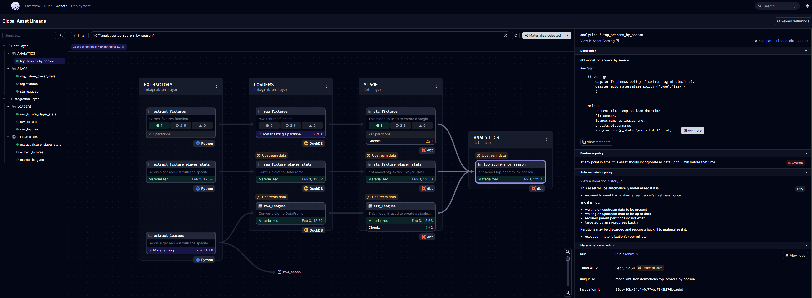

# Showcase - Dagster Data Platform

## Overview

This repository contains a showcase of a Dagster Data Platform. The showcase is a simple data pipeline that ingests data to GCP Cloud Storage from a third party API with football data, processes the data and loads into DuckDB. Then, dbt is used in another code location for some transformations. The showcase demonstrates the following features of the Dagster Data Platform:

* Dagster UI
* Software Defined Assets
* Asset Graph
* Partitioned Assets
* Materializations
* Code Locations
* dbt Integration
* Asset Checks
* Freshness Policies
* Automaterializations 

## Lineage View


## Get started  
Clone the repository and run the following commands:

```bash
docker compose up -d --build
```

### Pre-requisites
* Docker
* .env file with
* GCP credentials
* Motherduck token
* API key for football data
